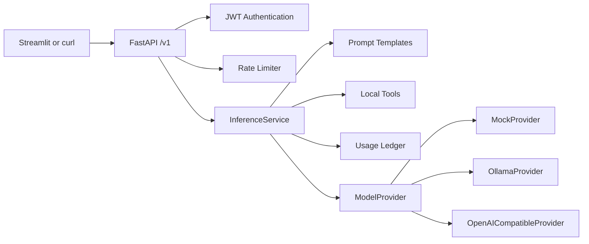

# Airlock Architecture

Airlock is a small API gateway that sits between a client application and a model provider.

The client only talks to the Airlock API. It does not need to know whether the model is:

* A fake/mock model used for testing
* A local model running through Ollama
* A hosted model exposed through an OpenAI-compatible API

The main architectural goal is to keep the **HTTP/API layer independent from the model provider**.

In simple terms:

```text
Client
  |
  | HTTP + JWT
  v
Airlock API
  |
  | validation / auth / rate limiting
  v
Inference Service
  |
  +---- Mock
  |
  +---- Ollama
  |
  +---- OpenAI-compatible provider
```

This means the application can change the model backend without changing the `/v1/chat` or `/v1/extract` API.

---

# 1. High-Level Architecture



A request typically moves through the system like this:

```text
Client
  |
  v
FastAPI Router
  |
  +--> JWT authentication
  |
  +--> Rate limiting
  |
  v
InferenceService
  |
  +--> Prompt handling
  |
  +--> Tool loop
  |
  +--> Structured output validation
  |
  +--> Usage tracking
  |
  v
ModelProvider
  |
  +--> Mock
  +--> Ollama
  +--> OpenAI-compatible API
```

Each layer has a specific responsibility.

---

# 2. The Main Design Principle

The most important idea in Airlock is:

> **HTTP code should not care which model provider is being used.**

For example, `/v1/chat` should not contain code like:

```python
if provider == "ollama":
    ...
elif provider == "groq":
    ...
elif provider == "mock":
    ...
```

Instead, the API calls the service, and the service talks to the provider abstraction:

```python
provider.complete(...)
```

The provider is responsible for knowing how to communicate with its specific backend.

This keeps the application easier to test and makes adding another provider much simpler.

---

# 3. Main Components

## FastAPI API Layer

Location:

```text
app/api/
```

This is the HTTP-facing part of Airlock.

It is responsible for things such as:

* HTTP routes
* Request validation
* Authentication dependencies
* Rate-limit dependencies
* HTTP status codes
* Converting application errors into HTTP responses
* Request IDs

For example:

```text
POST /v1/chat
POST /v1/extract
GET  /v1/models
GET  /v1/usage
```

The API layer should remain relatively thin.

It should not contain model-specific logic or large pieces of inference logic.

---

# 4. Authentication

Location:

```text
app/auth/
```

Airlock uses JWT authentication.

The authentication flow is:

```text
Client
   |
   | username + password
   v
/v1/auth/token
   |
   | JWT
   v
Client
   |
   | Bearer token
   v
Protected API
```

The API routes use the JWT dependency to make sure the request is authenticated before inference is performed.

This keeps authentication separate from the actual model logic.

---

# 5. Rate Limiting

Airlock includes a sliding-window rate limiter.

The purpose is to prevent a client from making unlimited inference requests.

Conceptually:

```text
Request
   |
   v
Rate Limiter
   |
   +---- limit available ----> Continue
   |
   +---- limit exceeded -----> 429
```

The rate limiter runs before the expensive model operation.

This is especially useful when using hosted providers where every request can consume tokens or API quota.

The current implementation stores rate-limit state in memory.

That means the limit is local to the running process.

---

# 6. InferenceService

Location:

```text
app/services/
```

`InferenceService` contains the main application logic.

This is where Airlock decides how to process an inference request.

It handles things such as:

* Prompt construction
* Tool execution
* Tool loops
* Structured-output handling
* Validation retries
* Usage calculation
* Communication with the provider abstraction

The service does **not** know about HTTP.

For example, it does not return:

```python
HTTPException(status_code=502)
```

Instead, it raises application-level errors such as:

```text
ModelBackendError
SchemaMismatchError
ToolLoopError
```

The API router later converts those errors into HTTP responses.

---

# 7. Why Keep HTTP Out of the Service?

This separation makes the service easier to test.

For example, we can test:

```text
InferenceService
      |
      v
MockProvider
```

without starting:

* FastAPI
* Uvicorn
* An HTTP server
* A browser

This gives us a much smaller unit to test.

The separation looks like:

```text
HTTP world
    |
    v
FastAPI Router
    |
    | application error
    v
InferenceService
    |
    v
ModelProvider
```

The router translates application errors into HTTP errors.

For example:

```text
ModelBackendError
        |
        v
HTTP 502
```

and:

```text
SchemaMismatchError
        |
        v
HTTP 422
```

---

# 8. Provider Layer

Location:

```text
app/providers/
```

This layer contains the actual model-provider implementations.

Airlock currently has three:

```text
MockProvider
OllamaProvider
OpenAICompatibleProvider
```

All providers implement the same basic interface:

```text
ModelProvider
```

The service only needs to know how to call the common interface.

It does not need to know the vendor-specific request format.

---

# 9. MockProvider

The mock provider is mainly for development and testing.

```text
MockProvider
```

does not require:

* GPU
* Model download
* External API
* API key

This makes it possible to run Airlock immediately after cloning the repository.

It is also useful for automated tests because its responses can be deterministic.

For example:

```text
pytest
   |
   v
InferenceService
   |
   v
MockProvider
```

The tests do not depend on a real model being available.

---

# 10. OllamaProvider

The Ollama provider is the local model path.

The architecture becomes:

```text
Airlock
   |
   v
OllamaProvider
   |
   v
Ollama
   |
   v
Local Model
```

This is useful when you want real model inference while keeping the model on your own machine or infrastructure.

The application still calls:

```text
ModelProvider.complete(...)
```

rather than directly calling Ollama from the API router.

---

# 11. OpenAI-Compatible Provider

The third provider supports hosted APIs that expose an OpenAI-compatible interface.

The architecture looks like:

```text
Airlock
   |
   v
OpenAICompatibleProvider
   |
   v
Hosted Model API
```

This keeps the application independent of the specific hosted provider.

For example, changing from one OpenAI-compatible service to another should primarily involve configuration rather than changes to `/v1/chat`.

---

# 12. Why Have Three Providers?

Each provider serves a different purpose.

| Provider          | Main purpose               |
| ----------------- | -------------------------- |
| Mock              | Testing and development    |
| Ollama            | Local real-model inference |
| OpenAI-compatible | Hosted inference           |

The important architectural point is that all three are hidden behind the same interface.

```text
                  ModelProvider
                       |
          ┌────────────┼────────────┐
          |            |            |
          v            v            v
        Mock         Ollama      Hosted API
```

Application code does not need provider-specific branches.

This is what makes provider switching possible without changing the public API.

---

# 13. Chat Request Flow

A normal chat request looks like:

```text
Client
  |
  | POST /v1/chat
  v
FastAPI Router
  |
  | Validate request
  | Validate JWT
  | Check rate limit
  v
InferenceService
  |
  | Add system prompt
  v
ModelProvider
  |
  v
Model
  |
  v
Response
  |
  v
Usage Ledger
  |
  v
Client
```

The API layer handles HTTP concerns.

The service handles inference concerns.

The provider handles vendor/model communication.

---

# 14. Chat With Tools

When tools are enabled, the flow becomes slightly more involved.

For example:

```text
User:
"How many tokens are in hello airlock?"
```

The flow is:

```text
Client
   |
   v
FastAPI
   |
   v
InferenceService
   |
   v
Model
   |
   | "I need estimate_tokens"
   v
Local Tool
   |
   | result
   v
InferenceService
   |
   | send tool result back
   v
Model
   |
   v
Final response
```

The service owns this loop.

The provider does not execute local tools itself.

This is important because tool execution is part of the gateway's application logic.

---

# 15. Tool Loop Protection

A model could theoretically keep requesting tools repeatedly.

Airlock therefore limits the number of provider calls using:

```text
MAX_TOOL_ROUNDS
```

The default is:

```text
3
```

Conceptually:

```text
Model
  |
  +--> Tool
  |
  +--> Model
          |
          +--> Tool
          |
          +--> Model
                  |
                  +--> Final response
```

Once the configured limit is reached, the service stops the loop.

This prevents an accidental or badly behaved model from creating an endless inference cycle.

---

# 16. Structured Extraction Flow

The `/v1/extract` endpoint follows a different path.

Suppose the client sends:

```text
Please fix the login bug today, this is urgent.
```

and asks for:

```text
schema_name = task
```

The service:

1. Loads the Pydantic schema.
2. Converts that schema into JSON Schema.
3. Includes the schema requirements in the system prompt.
4. Requests JSON from the provider.
5. Parses the response.
6. Validates it against the same Pydantic model.

The flow looks like:

```text
Client
  |
  v
/v1/extract
  |
  v
InferenceService
  |
  | JSON Schema
  v
Model
  |
  | JSON
  v
Pydantic validation
  |
  +---- valid ------> Return result
  |
  +---- invalid
          |
          v
      Repair prompt
          |
          v
        Model
          |
          +---- valid ------> Return result
          |
          +---- invalid ---> 422
```

The model gets one retry if its first response does not match the required structure.

---

# 17. Usage Tracking

Usage is handled through:

```text
UsageLedger
```

The service records things such as:

* Number of requests
* Prompt tokens
* Completion tokens
* Total tokens

The important design decision is that the inference service does not directly manipulate some global dictionary.

Instead, it talks to the ledger abstraction.

This keeps the implementation replaceable later.

---

# 18. In-Memory State

The current version keeps both usage and rate-limit state in memory.

That means:

```text
Process starts
      |
      v
State is created
      |
      v
Requests update state
      |
      v
Process restarts
      |
      v
State is lost
```

This is intentional for the current project because it keeps the service simple.

However, it has an important consequence:

> Two Airlock replicas would not share the same usage or rate-limit state.

For example:

```text
             Load Balancer
                  |
          ┌───────┴───────┐
          v               v
      Airlock A        Airlock B
          |               |
       Usage A          Usage B
       Limit A          Limit B
```

The two processes would have independent counters.

---

# 19. Scaling the State Layer

If Airlock needs multiple replicas, the obvious next step would be to move shared state into something like Redis.

The architecture would become:

```text
Airlock A ──┐
            |
Airlock B ──┼──> Redis
            |
Airlock C ──┘
```

Then all replicas could share:

* Rate-limit counters
* Usage information

The current code is structured to make that change easier because callers interact with abstractions such as:

```text
UsageLedger
SlidingWindowLimiter
```

rather than depending directly on Redis or another storage system.

---

# 20. Docker Architecture

The Docker image uses a multi-stage build.

The basic idea is:

```text
Builder image
     |
     | install dependencies
     v
Virtual environment
     |
     | copy into
     v
Slim runtime image
     |
     v
Airlock
```

The final runtime image is smaller because it does not need all of the build tooling used during dependency installation.

The container runs as:

```text
UID 10001
```

rather than root.

Running as a non-root user reduces the privileges available to the application if the container is compromised.

---

# 21. Health Endpoint

The health endpoint is intentionally unauthenticated:

```text
GET /health
```

This allows Docker or an orchestration system to check whether the service is alive without needing to obtain a JWT first.

For example:

```text
Container
   |
   | health check
   v
GET /health
   |
   +---- 200 ---> Healthy
   |
   +---- failure -> Unhealthy
```

Inference endpoints remain protected by JWT.

---

# 22. Startup Provider Selection

The provider is selected when the application starts.

The configuration uses:

```text
PROVIDER
```

For example:

```text
PROVIDER=mock
```

or:

```text
PROVIDER=ollama
```

or:

```text
PROVIDER=openai_compatible
```

This means one running Airlock process uses one configured provider.

The application does not dynamically switch providers for every request.

---

# 23. Separation of Responsibilities

The following table summarizes the architecture.

| Module          | Responsible for                                         | Not responsible for                    |
| --------------- | ------------------------------------------------------- | -------------------------------------- |
| `app/api`       | HTTP routes, status codes, auth/rate-limit dependencies | Prompt text, token calculations        |
| `app/services`  | Inference logic, tool loop, JSON repair, usage totals   | HTTP details, vendor-specific payloads |
| `app/providers` | Provider-specific API/model communication               | Passwords, rate limits                 |
| `app/schemas`   | Public request/response models                          | Choosing the model provider            |
| `app/auth`      | JWT creation and validation                             | Model inference                        |
| `streamlit_app` | User-facing demo client                                 | Server-side inference logic            |

This separation is one of the most important aspects of the project.

---

# 24. Error Handling

The service uses application-specific exceptions rather than HTTP exceptions.

For example:

```text
ModelBackendError
SchemaMismatchError
ToolLoopError
```

These are raised inside the service.

The API layer converts them into HTTP responses.

For example:

```text
ModelBackendError
        |
        v
502 Bad Gateway
```

```text
SchemaMismatchError
        |
        v
422 Unprocessable Entity
```

```text
ToolLoopError
        |
        v
502 Bad Gateway
```

This keeps business logic independent from FastAPI.

---

# 25. Why This Architecture?

Airlock is intentionally designed to be small.

The architecture tries to solve a few specific problems without turning the project into a large distributed system.

### Problem 1: Different model providers

Solution:

```text
ModelProvider interface
```

---

### Problem 2: Untrusted API requests

Solution:

```text
JWT + Pydantic validation
```

---

### Problem 3: Unlimited inference requests

Solution:

```text
Sliding-window rate limiter
```

---

### Problem 4: Models sometimes return invalid structured data

Solution:

```text
Pydantic validation + one repair retry
```

---

### Problem 5: Models need to interact with tools

Solution:

```text
InferenceService tool loop
```

---

### Problem 6: Testing real model providers is difficult

Solution:

```text
MockProvider
```

This gives the project a realistic gateway architecture while keeping the implementation small enough to understand.

---

# 26. End-to-End Example

A typical request can be visualized like this:

```text
                     AIRLOCK

┌─────────────┐
│   Client    │
│ Streamlit   │
│   or curl   │
└──────┬──────┘
       │
       │ HTTP + JWT
       ▼
┌─────────────────┐
│ FastAPI /v1     │
│                 │
│ • Validation    │
│ • Authentication│
│ • Rate limiting │
└────────┬────────┘
         │
         ▼
┌─────────────────┐
│ InferenceService│
│                 │
│ • Prompts       │
│ • Tools         │
│ • JSON retry    │
│ • Usage         │
└────────┬────────┘
         │
         ▼
┌─────────────────┐
│ ModelProvider   │
└────────┬────────┘
         │
    ┌────┼─────┐
    │    │     │
    ▼    ▼     ▼
  Mock Ollama Hosted
```

The client sees one API.

Everything below that API can change independently.

---

# 27. The Key Takeaway

The architecture can be summarized in one sentence:

> **Airlock keeps HTTP, authentication, inference logic, and model-provider details separate so that the API stays stable even when the underlying model changes.**

The most important boundary is:

```text
              Application
                   |
                   v
           ModelProvider
                   |
        ┌──────────┼──────────┐
        ▼          ▼          ▼
      Mock       Ollama     Hosted
```

As long as a new backend implements the `ModelProvider` contract, the existing `/v1/chat` and `/v1/extract` APIs do not need to change.
